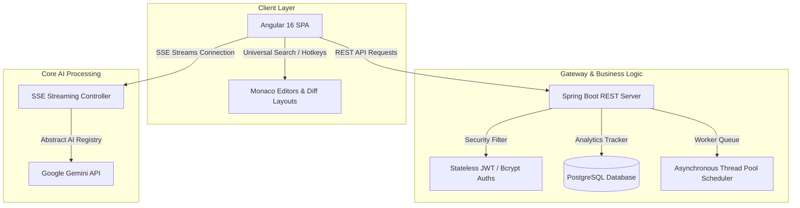

# DevMind AI - AI-Powered Software Engineering Platform 🚀

[](https://github.com/)
[](https://github.com/)
[](https://github.com/)
[](https://github.com/)

> **One-Line Pitch:** DevMind AI is an AI-powered Software Engineering Platform designed to help developers review, analyze, debug, document, and improve code using multiple AI models in a modern, drag-resizable IDE-like workspace.

---

## 🎨 Brand Statement & Motto

### *"Write Better Code. Learn Faster. Build Smarter."*

DevMind AI helps developers throughout the complete software development lifecycle—not just code generation. Think of it as:
**"GitHub Copilot + ChatGPT + SonarQube + VS Code Workspace all combined into a single, cohesive developer platform."**

---

## 🤔 Why DevMind AI?

Traditional coding workflows are heavily fragmented. Developers frequently jump between VS Code, ChatGPT browser tabs, official documentation pages, Google search engines, and StackOverflow threads. 

**DevMind AI consolidates this entire loop:**
```
Developer
   ↓
Open DevMind Workspace
   ↓
Choose Tool (Bug Finder, Doc Gen, Complexity)
   ↓
AI Reviews & Streams Real-Time Fixes
   ↓
Compare with Monaco Side-by-Side Diff Editor
   ↓
Analyze entire Github repository topologies & download PDF/Markdown reports.
```

---

## 👨‍💻 Target Users
- **Students**: Learn coding concepts, deconstruct complex loops, and prepare for interviews.
- **Developers**: Automate code reviews, detect logical vulnerabilities, and generate test assertions.
- **Team Leads**: Perform architecture audits, review pull requests, and enforce style guides.
- **Recruiters & Reviewers**: Evaluate project topologies, scan code quality, and audit SAST scores.

---

## 🎨 Key Features & Modules

### 💻 1. Workspace Pro split IDE
- **Draggable Drag-Resize Panels**: Adjust widths and heights for the Left Sidebar, Bottom Terminal Drawer, and Right Response Panel with mouse row/col-resizing handles.
- **Double-Click Reset**: Return any panel to its default layout dimensions instantly.
- **LocalStorage Caching**: Restores your custom panel layouts across browser reloads.
- **Boilerplates & Prompt Libraries**: Pre-fill the editor with boilerplate templates (Spring Boot controllers, React hooks, Dockerfiles) and prompt directives.
- **AI Thinking Checklist**: Track pipeline status (parsing, reasoning, formatting) in real time.
- **Multi-File Workspace Tabs**: Toggle between active files like a real IDE.
- **Side-by-Side comparative Diff Editor**: View the original code alongside parsed suggested fixes side-by-side using Monaco layouts.

### 🧠 2. Repository Scanner & GitHub Import
- **Cloning Scanner**: Clone any public GitHub repository URL or drag-and-drop source code ZIP archives.
- **Modular Topology Graph**: Visualize Controller -> Service -> Repository layer relationships in the UI.
- **Vulnerabilities Accordions**: Detailed SAST warnings (SQL injection risk, resource leaks, null pointers) with recommended quick fixes.
- **Automated README Builder**: Instantly generate clean Markdown documentation for analyzed repositories.

### 💬 3. Codebase Q&A Chat
- Ask structural questions about the analyzed codebase (e.g., *"Where is authentication implemented?"*) and receive detailed replies detailing specific file coordinates.

### ⚡ 4. Keyboard Palette Shortcuts
- **Ctrl+K**: Open Universal Search across operations, history logs, achievements, and settings.
- **Ctrl+Shift+P**: Access the developer action palette for IDE shortcuts (wrap lines, increase fonts, toggle themes).

### 🏆 5. Profile & Settings Consoles
- Real-time weekly analytics charts, latency metrics, and API access token generation for IDE extensions.
- HTML5 Canvas particle confetti explosions triggered on badge achievement unlocks.

---

## 🏢 Platform System Architecture



---

## 🚀 Getting Started

### Prerequisites
- **Node.js**: v18.0.0+
- **JDK**: OpenJDK 17
- **PostgreSQL**: Local database instance running on port 5432.

### Backend Setup
1. Open `backend/src/main/resources/application.properties` and update your database credentials:
   ```properties
   spring.datasource.url=jdbc:postgresql://localhost:5432/devmind
   spring.datasource.username=your_postgres_user
   spring.datasource.password=your_postgres_password
   ```
2. Export your Gemini API Key in your workspace shell:
   ```powershell
   $env:GEMINI_API_KEY="your-gemini-key-string"
   ```
3. Run database migrations and boot the server:
   ```bash
   ./mvnw clean spring-boot:run
   ```

### Frontend Setup
1. Navigate to the frontend directory:
   ```bash
   cd frontend
   ```
2. Install dependencies:
   ```bash
   npm install
   ```
3. Run the client development server:
   ```bash
   npm run start
   ```
4. Access the platform at: **`http://localhost:4200`**.

---

## 🔮 Future Roadmap
- [ ] **AI Pair Programming**: Collaborative real-time coding helper.
- [ ] **VS Code & JetBrains Plugins**: Run DevMind scans directly within local editors.
- [ ] **Docker & Kubernetes Review**: Visual container topology and orchestration vulnerability scanning.
- [ ] **Database Designer**: Auto-generate SQL schema diagrams from prompt structures.

---

## 📄 License
This project is licensed under the MIT License - see the LICENSE file for details.
